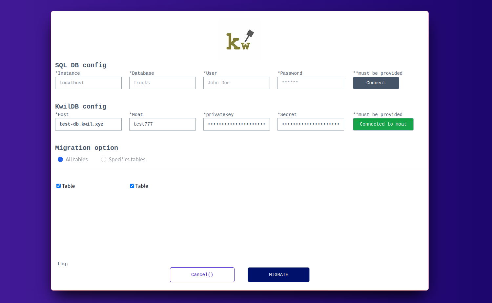

# KwBoard

## Getting Started

## The Demo is available on [YouTube](https://youtu.be/BHGAesNs0pg)

------



------

First, clone the project and run the server :

```bash
git clone https://github.com/bm777/kwboard.git
cd kwboard

# install dependencies
npm install

# now run
npm run dev
# or
yarn dev
```


Open [http://localhost:3000](http://localhost:3000) with your browser to see the result.

